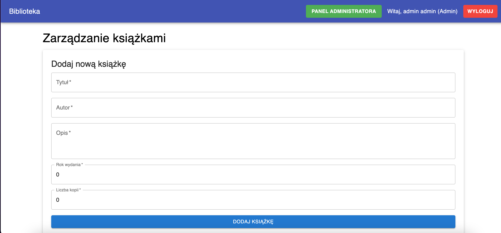

# README - Library Management Application

# Branch: `mongo-db`

This README refers to the `mongo-db` branch.

### Project Structure

The project has three branches:

- **`main`** – the base version of the project using `json-server`.
- **`mongo-db`** – the application is deployed on [Vercel](https://vercel.com) and connected to **MongoDB**.
- **`fullStack`** – contains a local backend written in **Express.js**, located in the `backend` folder.

Ten plik README dotyczy brancha `mongo-db`.

### Struktura projektu

Projekt posiada trzy branche:

- **`main`** – podstawowa wersja projektu wykorzystująca `json-server`.
- **`mongo-db`** – aplikacja została zdeployowana na [Vercel](https://vercel.com) i połączona z bazą danych **MongoDB**.
- **`fullStack`** – zawiera lokalny backend napisany w **Express.js**, znajdujący się w folderze `backend`.

# Screen z aplikacji / Screen from the App

# Opis projektu

Aplikacja do zarządzania biblioteką, pozwalająca na łatwe rejestrowanie użytkowników, logowanie, wypożyczanie książek, a także umożliwiająca administratorowi zarządzanie zasobami biblioteki. Aplikacja jest podzielona na dwa typy użytkowników: **Klient** oraz **Administrator**, a każda akcja wykonywana przez użytkownika jest rejestrowana w logach systemowych.
Aplikacja została zdeployowana na vercela i podłązona do bazy danych mongo-db. Na platformie vercel zostały
wykorzystane api-routy w celu uniknięcia korzystania z dodatkowego backendu.

# Project Description

An application for library management that allows easy user registration, login, book borrowing, and enables the administrator to manage the library's resources. The application is divided into two user types: **Client** and **Administrator**, and every action performed by a user is recorded in system logs.

The application has been deployed on Vercel and connected to a MongoDB database. On the Vercel platform, API routes have been used to avoid the need for an additional backend.

# Główne funkcje:

- Rejestracja użytkownika i nadawanie unikalnego kodu karty bibliotecznej.
- Logowanie użytkowników za pomocą karty bibliotecznej.
- Lista książek dostępnych do wypożyczenia.
- Możliwość wypożyczenia książki oraz podglądu szczegółów książki.
- Panel zarządzania książkami dla administratora: dodawanie, edytowanie, usuwanie książek.
- Panel użytkownika: przeglądanie historii wypożyczeń oraz statystyki.

# Main Features:

- User registration with assignment of a unique library card code.
- User login using the library card.
- List of books available for borrowing.
- Ability to borrow books and view book details.
- Book management panel for the administrator: adding, editing, and deleting books.
- User panel: browsing borrowing history and viewing statistics.

# Architektura

Aplikacja składa się z dwóch głównych komponentów:

Front-endu, odpowiedzialnego za interfejs użytkownika, zbudowanego w oparciu o framework React. Do zarządzania stanem zapytań i ich buforowania wykorzystano bibliotekę TanStack Query, co znacząco poprawia wydajność oraz minimalizuje liczbę niepotrzebnych zapytań do serwera. Część komponentów odpowiadających za logikę aplikacji, uległa zmianie w porównaniu z bazową wersją, więc do napisania są testy.

API Routes hostowanych na platformie Vercel, które pełnią rolę warstwy backendowej. Odpowiadają one za komunikację z bazą danych MongoDB, realizując logikę dostępu do danych oraz ich przetwarzanie.

# Architecture

The application consists of two main components:

- **Front-end**, responsible for the user interface, built using the React framework. The TanStack Query library is used for managing query state and caching, which significantly improves performance and minimizes unnecessary server requests. Some components responsible for application logic have changed compared to the base version, so tests still need to be written.

- **API Routes** hosted on the Vercel platform, which serve as the backend layer. They handle communication with the MongoDB database, implementing data access logic and processing.

# Tech Stack

| Komponent             | Użyta technologia                 | Dlaczego?                                                    |
| --------------------- | --------------------------------- | ------------------------------------------------------------ |
| Frontend              | React, Material UI                | React zapewnia elastyczność, Material UI upraszcza interfejs |
| Zarządzanie danymi    | TanStack Query                    | Buforowanie, synchronizacja i optymalizacja zapytań do API   |
| Autoryzacja           | JWT, Role (Klient, Administrator) | Prosta autoryzacja z podziałem ról w aplikacji               |
| Baza danych           | mongoDb                           | Przechowywanie danych użytkowników i książek                 |
| Testy                 | Vitest, Playwright                | Vitest dla testów jednostkowych, Playwright dla testów E2E   |
| Formatowanie i Linter | Prettier, ESLint, Husky           | Automatyczne formatowanie kodu i walidacja linterska         |
| Paginacja w tabelach  | Material UI, React                | Wbudowane rozwiązanie do paginacji tabel                     |

# Tech Stack

| Component           | Technology Used                    | Why?                                                             |
| ------------------- | ---------------------------------- | ---------------------------------------------------------------- |
| Frontend            | React, Material UI                 | React provides flexibility, Material UI simplifies the interface |
| Data Management     | TanStack Query                     | Caching, synchronization, and optimization of API queries        |
| Authorization       | JWT, Roles (Client, Administrator) | Simple authorization with role-based access in the application   |
| Database            | MongoDB                            | Storing user and book data                                       |
| Testing             | Vitest, Playwright                 | Vitest for unit tests, Playwright for E2E tests                  |
| Formatting & Linter | Prettier, ESLint, Husky            | Automatic code formatting and lint validation                    |
| Table Pagination    | Material UI, React                 | Built-in solution for table pagination                           |

# Install dependencies

npm install

# Start development server

npm run dev

# Skrypty w aplikacji

| Skrypt      | Opis                                                    |
| ----------- | ------------------------------------------------------- |
| `dev`       | Uruchamia aplikację w trybie deweloperskim              |
| `build`     | Buduje aplikację i generuje statyczne pliki produkcyjne |
| `lint`      | Uruchamia ESLint do sprawdzenia jakości kodu            |
| `lint-fix`  | Uruchamia ESLint i automatycznie naprawia możliwe błędy |
| `preview`   | Uruchamia aplikację po zbudowaniu w trybie podglądu     |
| `prettier`  | Formatuje kod przy użyciu Prettiera                     |
| `prepare`   | Przygotowuje środowisko dla Husky (hooki pre-commit)    |
| `test`      | Uruchamia testy jednostkowe przy pomocy Vitest          |
| `test:ci`   | Uruchamia testy w trybie ciągłej integracji             |
| `test:e2e`  | Uruchamia testy E2E przy użyciu Playwright              |
| `typecheck` | Sprawdza typy w TypeScript bez generowania kodu         |

# Scripts in the Application

| Script      | Description                                                  |
| ----------- | ------------------------------------------------------------ |
| `dev`       | Runs the application in development mode                     |
| `build`     | Builds the application and generates static production files |
| `lint`      | Runs ESLint to check code quality                            |
| `lint-fix`  | Runs ESLint and automatically fixes possible errors          |
| `preview`   | Runs the application in preview mode after building          |
| `prettier`  | Formats code using Prettier                                  |
| `prepare`   | Sets up the environment for Husky (pre-commit hooks)         |
| `test`      | Runs unit tests using Vitest                                 |
| `test:ci`   | Runs tests in continuous integration mode                    |
| `test:e2e`  | Runs end-to-end tests using Playwright                       |
| `typecheck` | Checks TypeScript types without generating code              |

# Co zostało zrobione?

- Rejestracja użytkowników z nadawaniem unikalnego kodu karty bibliotecznej
- Logowanie i wylogowywanie użytkowników
- Wypożyczenie książek z automatycznym zarządzaniem liczbą dostępnych egzemplarzy
- Panel administracyjny do zarządzania książkami i wypożyczeniami
- System logów rejestrujący wszystkie akcje użytkowników
- Paginacja tabel z wynikami wypożyczeń
- Testy jednostkowe i E2E

# What Has Been Done?

- User registration with assignment of a unique library card code
- User login and logout
- Book borrowing with automatic management of available copies
- Administrative panel for managing books and borrowings
- Logging system that records all user actions
- Pagination of tables with borrowing results
- Unit and E2E tests

# Plany na przyszłość

- Rozbudowa systemu powiadomień o terminach zwrotu książek
- Implementacja zaawansowanej wyszukiwarki książek
- Napisanie testów jednostkowych do brancha mongo-db, gdzie zmianie uległa logika komponentów
- napisanie własnego backendu i zdeployowanie go, a następnie próba połączenia aplikacji

# Future Plans

- Expansion of the notification system for book return deadlines
- Implementation of an advanced book search feature
- Writing unit tests for the mongo-db branch, where the component logic has changed
- Developing and deploying a custom backend, followed by an attempt to connect the application to it

# Dane dostępowe

Dane dostępowe potrzebne do logowania

Administrator:

- cardId :jnem32ykz
- password: 123123

Klient:

- cardId: lr090fz3e
- password: 123123

# Access Credentials

Credentials needed for logging in

**Administrator:**

- cardId: jnem32ykz
- password: 123123

**Client:**

- cardId: lr090fz3e
- password: 123123

# Kontakt do autora / Contact to the author

Email: tomek12olech@gmail.com
GitHub: [takimi12](https://github.com/takimi12)
LinkedIn: https://www.linkedin.com/in/tomaszolechfrontend
